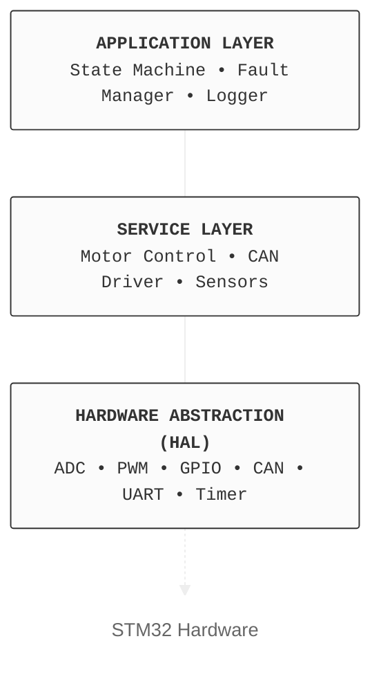
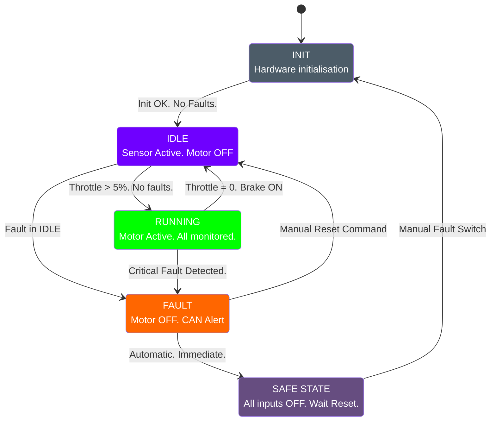

# System Design — Smart EV ECU

| Field           | Value            |
| --------------- | ---------------- |
| **Document ID** | BASESYNC-DES-001 |
| **Version**     | 1.0              |
| **Status**      | ✅ Approved       |

***

## Table of Contents

1. [Design Philosophy](002_system_design.md#design-philosophy)
2. [High-Level Architecture](002_system_design.md#high-level-architecture)
3. [Module Breakdown](002_system_design.md#module-breakdown)
4. [File & Folder Structure](002_system_design.md#file--folder-structure)
5. [Module Interface Definitions](002_system_design.md#module-interface-definitions)
6. [Hardware Pin Mapping](002_system_design.md#hardware-pin-mapping)
7. [Data Flow Diagram](002_system_design.md#data-flow-diagram)
8. [State Machine Design](002_system_design.md#state-machine-design)
9. [Memory Map](002_system_design.md#memory-map)
10. [Peripheral Configuration](002_system_design.md#peripheral-configuration)
11. [Timing Configuration](002_system_design.md#timing-configuration)

***

## Design Philosophy

### Layered Architecture

We use a **3-layer architecture** — the same pattern used in automotive software (AUTOSAR-inspired):



**Why layers?**

* You can swap the STM32 for a different MCU by only changing the HAL layer.
* You can test the application layer without real hardware (unit tests use stubs).

***

## High-Level Architecture

```
                        ┌──────────────────────────────────────────────┐
                        │                  Smart EV ECU                │
                        │                                              │
  Sensors ─────────────►│  Sensor HAL  ──►  State Machine              │
                        │                       │                      │
  Throttle/Brake ──────►│  GPIO / ADC   ──►  Fault Manager             │
                        │                       │                      │
  CAN Bus  ◄───────────►│  CAN Driver   ◄──►  Motor Control  ──► PWM   │
                        │                       │                      │
  UART / PC ◄───────────│  Logger       ◄───────┘                      │
                        └──────────────────────────────────────────────┘
```

***

## Module Breakdown

### Module 1 — Sensor HAL

**Responsibility:** Read all physical/simulated sensors and return calibrated values.

```
sensor_hal.h / sensor_hal.c
├── read_battery_temp()     → float °C
├── read_motor_temp()       → float °C
├── read_battery_voltage()  → float V
├── read_battery_current()  → float A
├── read_throttle()         → float 0–100%
├── read_speed()            → float RPM
├── read_brake_switch()     → bool
└── read_fault_switch()     → bool
```

***

### Module 2 — Motor Control

**Responsibility:** Generate PWM to control motor speed based on throttle and safety state.

```
motor_control.h / motor_control.c
├── motor_init()
├── motor_set_throttle(float pct)
├── motor_stop()              ← called on fault or brake
└── motor_soft_start(float target_pct, uint32_t ramp_ms)
```

***

### Module 3 — Fault Manager

**Responsibility:** Monitor all sensor data against thresholds. Manage fault state.

```
fault_manager.h / fault_manager.c
├── fault_check_all(SensorData_t *data)
├── fault_get_active()         → FaultCode_t
├── fault_clear()              ← explicit command only
├── fault_store_to_flash()
└── Fault codes:
    ├── FAULT_NONE             = 0x00
    ├── FAULT_OVER_TEMP        = 0x01
    ├── FAULT_OVER_CURRENT     = 0x02
    ├── FAULT_UNDER_VOLTAGE    = 0x03
    └── FAULT_OVER_VOLTAGE     = 0x04
```

***

### Module 4 — CAN Driver

**Responsibility:** Encode and transmit CAN frames. Receive and decode incoming frames.

```
can_driver.h / can_driver.c
├── can_init()
├── can_tx_status_frame(SystemState_t state, FaultCode_t fault)
├── can_tx_sensor_pack1(float batt_temp, float motor_temp, float speed)
├── can_tx_sensor_pack2(float voltage, float current, float throttle)
├── can_tx_fault_frame(FaultCode_t fault, uint32_t timestamp)
└── can_rx_handler()           ← parses incoming commands
```

***

### Module 5 — Logger

**Responsibility:** Format and transmit data over UART in Teleplot format.

```
logger.h / logger.c
├── logger_init()
├── logger_log_sensors(SensorData_t *data)
├── logger_log_fault(FaultCode_t fault, uint32_t timestamp)
└── logger_log_state_change(SystemState_t old, SystemState_t new)
```

***

### Module 6 — State Machine

**Responsibility:** Top-level control logic. Decides transitions between states.

```
state_machine.h / state_machine.c
├── sm_init()
├── sm_run()                   ← called every main loop tick
├── sm_get_state()             → SystemState_t
└── States:
    ├── STATE_INIT
    ├── STATE_IDLE
    ├── STATE_RUNNING
    └── STATE_SAFE
```

***

## File & Folder Structure

```
smart-ev-ecu/
├── Core/
│   ├── Inc/
│   │   ├── sensor_hal.h
│   │   ├── motor_control.h
│   │   ├── fault_manager.h
│   │   ├── can_driver.h
│   │   ├── logger.h
│   │   └── state_machine.h
│   └── Src/
│       ├── main.c
│       ├── sensor_hal.c
│       ├── motor_control.c
│       ├── fault_manager.c
│       ├── can_driver.c
│       ├── logger.c
│       └── state_machine.c
├── Drivers/
│   └── STM32xx_HAL_Driver/    ← STM32 auto-generated HAL
├── Tests/
│   ├── test_sensor_hal.c
│   ├── test_motor_control.c
│   ├── test_fault_manager.c
│   └── test_state_machine.c
├── Docs/
│   ├── BASESYNC-REQ-001.md
│   └── BASESYNC-DES-001.md
└── CMakeLists.txt / Makefile
```

***

## Module Interface Definitions

### Shared Data Structures

```c
typedef struct {
    float batt_temp;      // °C
    float motor_temp;     // °C
    float voltage;        // V
    float current;        // A
    float throttle;       // 0–100 %
    float speed;          // RPM
    bool  brake_active;
    bool  fault_switch;
} SensorData_t;

typedef enum {
    STATE_INIT    = 0,
    STATE_IDLE    = 1,
    STATE_RUNNING = 2,
    STATE_SAFE    = 3
} SystemState_t;

typedef enum {
    FAULT_NONE          = 0x00,
    FAULT_OVER_TEMP     = 0x01,
    FAULT_OVER_CURRENT  = 0x02,
    FAULT_UNDER_VOLTAGE = 0x03,
    FAULT_OVER_VOLTAGE  = 0x04
} FaultCode_t;
```

***

## Hardware Pin Mapping

> ⚠️ Pin assignments to be completed during hardware bring-up phase.

<table><thead><tr><th>Signal</th><th width="104.199951171875">STM32 Pin</th><th width="155">Peripheral</th><th>Notes</th></tr></thead><tbody><tr><td>Battery Temp</td><td>—</td><td>ADC1_IN0</td><td>NTC Thermistor / LM35</td></tr><tr><td>Motor Temp</td><td>—</td><td>ADC1_IN1</td><td>NTC Thermistor</td></tr><tr><td>Current Sense</td><td>—</td><td>ADC1_IN2</td><td>ACS712 output</td></tr><tr><td>Voltage Sense</td><td>—</td><td>ADC1_IN3</td><td>Resistor divider</td></tr><tr><td>Throttle POT</td><td>—</td><td>ADC1_IN4</td><td>0–3.3V pot</td></tr><tr><td>Speed Encoder A</td><td>—</td><td>TIM3_CH1</td><td>Encoder mode</td></tr><tr><td>Speed Encoder B</td><td>—</td><td>TIM3_CH2</td><td>Encoder mode</td></tr><tr><td>Motor PWM</td><td>—</td><td>TIM1_CH1</td><td>PWM output</td></tr><tr><td>Brake Switch</td><td>—</td><td>GPIO_IN</td><td>Pull-up, active low</td></tr><tr><td>Fault Switch</td><td>—</td><td>GPIO_IN</td><td>Pull-up, active low</td></tr><tr><td>CAN Tx</td><td>—</td><td>CAN1_TX</td><td>To TJA1050</td></tr><tr><td>CAN Rx</td><td>—</td><td>CAN1_RX</td><td>From TJA1050</td></tr><tr><td>UART Tx</td><td>—</td><td>UART1_TX</td><td>To USB-Serial</td></tr><tr><td>UART Rx</td><td>—</td><td>UART1_RX</td><td>From USB-Serial</td></tr><tr><td>Status LED</td><td>—</td><td>GPIO_OUT</td><td>Onboard LED</td></tr></tbody></table>

***

## Data Flow Diagram

```
 ┌──────────────┐     SensorData_t      ┌──────────────────┐
 │  Sensor HAL  │ ─────────────────────► │  Fault Manager   │
 └──────────────┘                        └────────┬─────────┘
        │                                         │ FaultCode_t
        │ SensorData_t                            ▼
        │                               ┌──────────────────┐
        └──────────────────────────────►│  State Machine   │
                                        └────────┬─────────┘
                                                 │
                      ┌──────────────────────────┼──────────────────────────┐
                      │                          │                          │
                      ▼                          ▼                          ▼
             ┌───────────────┐         ┌──────────────────┐       ┌───────────────┐
             │ Motor Control │         │   CAN Driver     │       │    Logger     │
             │  (PWM output) │         │ (CAN Tx frames)  │       │ (UART output) │
             └───────────────┘         └──────────────────┘       └───────────────┘
```

***

## State Machine Design



### Transition Table

<table><thead><tr><th width="138.60003662109375">From</th><th width="147.20001220703125">To</th><th>Condition</th></tr></thead><tbody><tr><td><code>INIT</code></td><td><code>IDLE</code></td><td>Hardware init complete, no faults</td></tr><tr><td><code>IDLE</code></td><td><code>RUNNING</code></td><td><code>throttle > 0</code> and no active fault</td></tr><tr><td><code>RUNNING</code></td><td><code>IDLE</code></td><td><code>throttle == 0</code> and no active fault</td></tr><tr><td><code>RUNNING</code></td><td><code>SAFE_STATE</code></td><td>Any fault detected</td></tr><tr><td><code>IDLE</code></td><td><code>SAFE_STATE</code></td><td>Any fault detected</td></tr><tr><td><code>SAFE_STATE</code></td><td><code>IDLE</code></td><td>Explicit <code>fault_clear()</code> command received</td></tr></tbody></table>

***

## Memory Map

> ⚠️ Exact addresses to be confirmed from STM32 linker script.

<table><thead><tr><th width="95.39996337890625">Region</th><th width="129.4000244140625">Start</th><th width="130.800048828125">End</th><th width="92.7999267578125">Size</th><th>Contents</th></tr></thead><tbody><tr><td>Flash</td><td><code>0x0800 0000</code></td><td><code>0x0800 FFFF</code></td><td>64 KB</td><td>Firmware code + const data</td></tr><tr><td>SRAM</td><td><code>0x2000 0000</code></td><td><code>0x2000 4FFF</code></td><td>20 KB</td><td>Stack, heap, globals</td></tr><tr><td>Fault Log</td><td><code>0x0800 F000</code></td><td><code>0x0800 FFFF</code></td><td>4 KB</td><td>Last N fault codes (Flash)</td></tr></tbody></table>

***

## Peripheral Configuration

<table><thead><tr><th width="107.4000244140625">Peripheral</th><th>Config</th><th>Notes</th></tr></thead><tbody><tr><td><strong>ADC1</strong></td><td>12-bit, DMA circular, 5-channel scan</td><td>All sensors on single ADC with DMA</td></tr><tr><td><strong>TIM1 CH1</strong></td><td>PWM mode, 20kHz, 0–100% duty cycle</td><td>Motor control</td></tr><tr><td><strong>TIM3</strong></td><td>Encoder interface mode</td><td>Speed measurement</td></tr><tr><td><strong>TIM4</strong></td><td>1ms tick interrupt</td><td>Main loop tick</td></tr><tr><td><strong>CAN1</strong></td><td>500 kbps, 11-bit IDs, normal mode</td><td>Vehicle network</td></tr><tr><td><strong>UART1</strong></td><td>115200 baud, 8N1, TX-only (RX optional)</td><td>UART logging</td></tr><tr><td><strong>IWDG</strong></td><td>500ms timeout, LSI clock</td><td>Independent watchdog</td></tr></tbody></table>

***

## Timing Configuration

| Task                  | Period          | Mechanism         | Priority |
| --------------------- | --------------- | ----------------- | -------- |
| Speed encoder read    | 10ms            | TIM4 interrupt    | High     |
| Throttle / brake read | 10ms            | TIM4 interrupt    | High     |
| Battery current read  | 50ms            | TIM4 tick counter | High     |
| Battery voltage read  | 50ms            | TIM4 tick counter | High     |
| Battery temp read     | 100ms           | TIM4 tick counter | Medium   |
| Motor temp read       | 100ms           | TIM4 tick counter | Medium   |
| CAN status frame TX   | 100ms           | TIM4 tick counter | Medium   |
| UART sensor log       | 100ms           | TIM4 tick counter | Low      |
| Fault check           | Every main loop | Synchronous call  | High     |
| Watchdog feed         | <500ms          | Every main loop   | Critical |

***

_BASESYNC-DES-001 · v1.0 · Approved_
