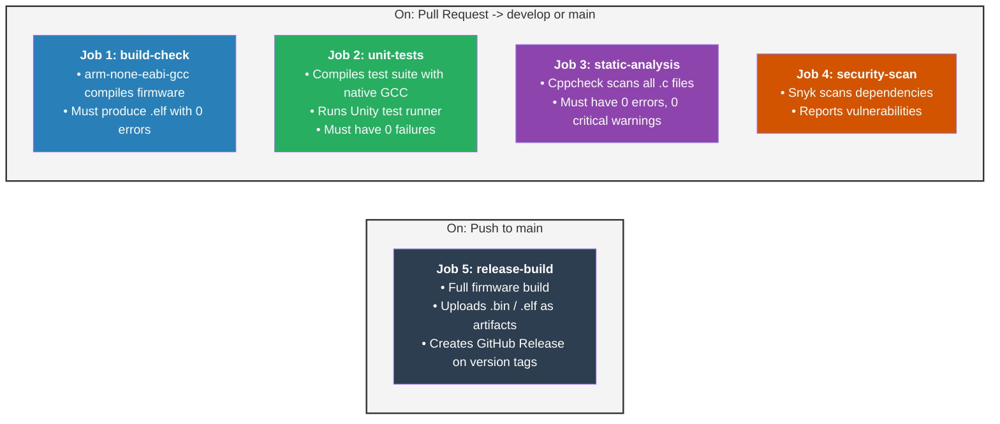
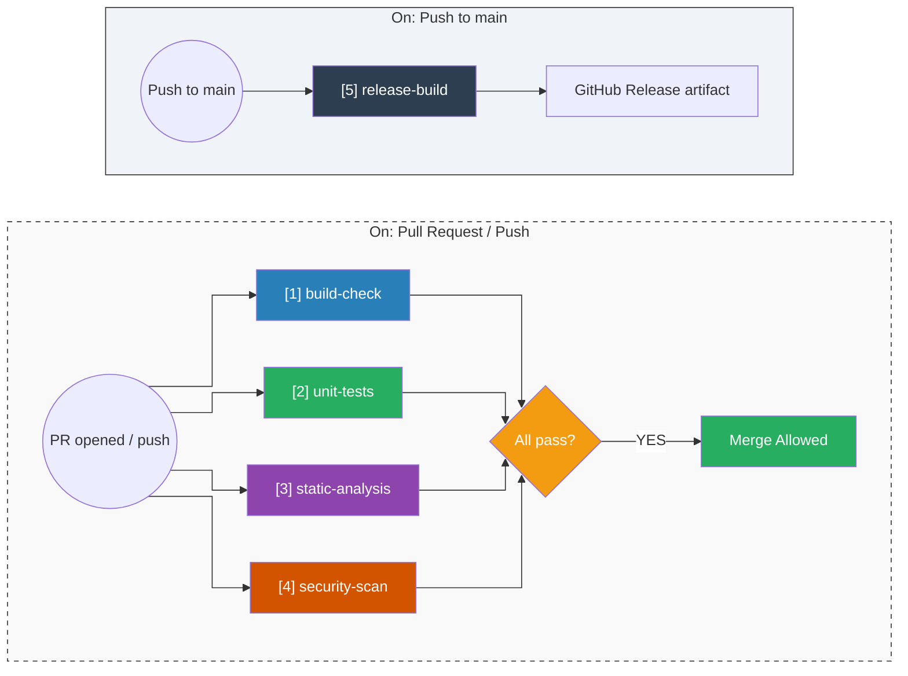

# CI/CD Pipeline — GitHub Actions

| Field | Value |
|---|---|
| **Document ID** | BASESYNC-CICD-001 |
| **Version** | 1.0 |
| **Status** | ✅ Approved |

---

## Table of Contents

1. [What Is CI/CD and Why Does It Matter?](#what-is-cicd-and-why-does-it-matter)
2. [Pipeline Architecture](#pipeline-architecture)
3. [GitHub Actions Workflow Files](#github-actions-workflow-files)
   - [Workflow 1 — Firmware Build Check](#workflow-1--firmware-build-check)
   - [Workflow 2 — Unit Tests](#workflow-2--unit-tests)
   - [Workflow 3 — Static Analysis](#workflow-3--static-analysis)
   - [Workflow 4 — Security Scan](#workflow-4--security-scan)
   - [Workflow 5 — Release Build](#workflow-5--release-build)
4. [Dependabot Configuration](#dependabot-configuration)
5. [CMake Toolchain File](#cmake-toolchain-file)
6. [Reading CI Results](#reading-ci-results)

---

## What Is CI/CD and Why Does It Matter?

### CI — Continuous Integration

Every time someone pushes code or opens a PR, a robot automatically:

1. Compiles the firmware
2. Runs all unit tests
3. Runs static analysis (Cppcheck)
4. Scans for security issues (Snyk)

> ⛔ If any of these fail → **the PR is blocked**. Code cannot merge until it's fixed.

### CD — Continuous Deployment

Automatically deploys/releases when code reaches `main`. For firmware, this means: building a release binary and attaching it to a **GitHub Release**.

---

## Pipeline Architecture



### Job Dependency Graph



---

## GitHub Actions Workflow Files

### Workflow 1 — Firmware Build Check

**File:** `.github/workflows/build.yml`

```yaml
name: Firmware Build Check

on:
  pull_request:
    branches: [main, develop]
  push:
    branches: [main, develop]

jobs:
  build-check:
    runs-on: ubuntu-latest

    steps:
      - name: Checkout repository
        uses: actions/checkout@v4

      - name: Install ARM GCC toolchain
        run: |
          sudo apt-get update
          sudo apt-get install -y gcc-arm-none-eabi cmake ninja-build

      - name: Configure CMake
        run: cmake -B build -DCMAKE_TOOLCHAIN_FILE=cmake/arm-gcc-toolchain.cmake

      - name: Build firmware
        run: cmake --build build --parallel

      - name: Upload ELF artifact
        uses: actions/upload-artifact@v4
        with:
          name: firmware-elf
          path: build/*.elf
```

---

### Workflow 2 — Unit Tests

**File:** `.github/workflows/unit-tests.yml`

```yaml
name: Unit Tests

on:
  pull_request:
    branches: [main, develop]
  push:
    branches: [main, develop]

jobs:
  unit-tests:
    runs-on: ubuntu-latest

    steps:
      - name: Checkout repository
        uses: actions/checkout@v4

      - name: Install native GCC and CMake
        run: |
          sudo apt-get update
          sudo apt-get install -y gcc cmake ninja-build

      - name: Configure CMake (native, test build)
        run: cmake -B build-tests -DBUILD_TESTS=ON

      - name: Build test suite
        run: cmake --build build-tests --parallel

      - name: Run Unity test runner
        run: ./build-tests/tests/run_tests

      - name: Upload test results
        if: always()
        uses: actions/upload-artifact@v4
        with:
          name: test-results
          path: build-tests/tests/results/
```

---

### Workflow 3 — Static Analysis

**File:** `.github/workflows/static-analysis.yml`

```yaml
name: Static Analysis

on:
  pull_request:
    branches: [main, develop]
  push:
    branches: [main, develop]

jobs:
  static-analysis:
    runs-on: ubuntu-latest

    steps:
      - name: Checkout repository
        uses: actions/checkout@v4

      - name: Install Cppcheck
        run: |
          sudo apt-get update
          sudo apt-get install -y cppcheck

      - name: Run Cppcheck
        run: |
          cppcheck \
            --enable=all \
            --error-exitcode=1 \
            --suppress=missingIncludeSystem \
            --inline-suppr \
            Core/Src/ Core/Inc/

      - name: Upload Cppcheck report
        if: always()
        uses: actions/upload-artifact@v4
        with:
          name: cppcheck-report
          path: cppcheck-report.xml
```

---

### Workflow 4 — Security Scan

**File:** `.github/workflows/security.yml`

```yaml
name: Security Scan

on:
  pull_request:
    branches: [main, develop]
  push:
    branches: [main]
  schedule:
    - cron: '0 6 * * 1'   # Every Monday at 06:00 UTC

jobs:
  security-scan:
    runs-on: ubuntu-latest

    steps:
      - name: Checkout repository
        uses: actions/checkout@v4

      - name: Run Snyk security scan
        uses: snyk/actions/node@master
        env:
          SNYK_TOKEN: ${{ secrets.SNYK_TOKEN }}
        with:
          args: --severity-threshold=high

      - name: Upload Snyk results
        if: always()
        uses: actions/upload-artifact@v4
        with:
          name: snyk-report
          path: snyk-report.json
```

---

### Workflow 5 — Release Build

**File:** `.github/workflows/release.yml`

```yaml
name: Release Build

on:
  push:
    branches: [main]
    tags:
      - 'v*.*.*'

jobs:
  release-build:
    runs-on: ubuntu-latest

    steps:
      - name: Checkout repository
        uses: actions/checkout@v4

      - name: Install ARM GCC toolchain
        run: |
          sudo apt-get update
          sudo apt-get install -y gcc-arm-none-eabi cmake ninja-build

      - name: Configure CMake
        run: cmake -B build -DCMAKE_TOOLCHAIN_FILE=cmake/arm-gcc-toolchain.cmake -DCMAKE_BUILD_TYPE=Release

      - name: Build release firmware
        run: cmake --build build --parallel

      - name: Upload release artifacts
        uses: actions/upload-artifact@v4
        with:
          name: firmware-release
          path: |
            build/*.elf
            build/*.bin
            build/*.map

      - name: Create GitHub Release
        if: startsWith(github.ref, 'refs/tags/')
        uses: softprops/action-gh-release@v2
        with:
          files: |
            build/*.elf
            build/*.bin
          generate_release_notes: true
```

---

## Dependabot Configuration

Dependabot automatically opens PRs when GitHub Actions dependencies are outdated.

**File:** `.github/dependabot.yml`

```yaml
version: 2

updates:
  - package-ecosystem: "github-actions"
    directory: "/"
    schedule:
      interval: "weekly"
      day: "monday"
    commit-message:
      prefix: "ci"
    labels:
      - "dependencies"
      - "ci"
```

---

## CMake Toolchain File

Required for CI to cross-compile for ARM Cortex-M.

**File:** `cmake/arm-gcc-toolchain.cmake`

```cmake
set(CMAKE_SYSTEM_NAME Generic)
set(CMAKE_SYSTEM_PROCESSOR arm)

# Toolchain prefix
set(TOOLCHAIN_PREFIX arm-none-eabi-)

set(CMAKE_C_COMPILER   ${TOOLCHAIN_PREFIX}gcc)
set(CMAKE_CXX_COMPILER ${TOOLCHAIN_PREFIX}g++)
set(CMAKE_ASM_COMPILER ${TOOLCHAIN_PREFIX}gcc)
set(CMAKE_OBJCOPY      ${TOOLCHAIN_PREFIX}objcopy)
set(CMAKE_SIZE         ${TOOLCHAIN_PREFIX}size)

# Prevent CMake from testing the compiler against the host
set(CMAKE_TRY_COMPILE_TARGET_TYPE STATIC_LIBRARY)

# Target CPU flags — adjust for your STM32 variant
set(CPU_FLAGS "-mcpu=cortex-m4 -mthumb -mfpu=fpv4-sp-d16 -mfloat-abi=hard")

set(CMAKE_C_FLAGS   "${CPU_FLAGS} -fdata-sections -ffunction-sections" CACHE STRING "" FORCE)
set(CMAKE_EXE_LINKER_FLAGS "-Wl,--gc-sections -specs=nano.specs" CACHE STRING "" FORCE)
```

---

## Reading CI Results

### When a CI Check Fails

1. Go to your PR on GitHub.
2. Scroll down to the **Checks** section.
3. Click on the failing check name.
4. Read the red output — it tells you exactly what failed.

### Common Failures & Fixes

| Failure | Likely Cause | Fix |
|---|---|---|
| `build-check` fails | Compilation error in `.c` / `.h` | Fix the compiler error shown in the log |
| `unit-tests` fails | A test assertion failed | Check which `TEST_ASSERT` failed and fix the logic |
| `static-analysis` fails | Cppcheck found an error | Fix the flagged line; or add `// cppcheck-suppress` with justification |
| `security-scan` fails | Snyk found a high-severity CVE | Update the affected dependency version |
| `release-build` fails | Linker error or memory overflow | Check `.map` file; ensure firmware fits within Flash/RAM limits |

### Branch Protection Rules

Configure these in **GitHub → Settings → Branches → Branch protection rules** for `main` and `develop`:

```
☑ Require status checks to pass before merging
  ☑ build-check
  ☑ unit-tests
  ☑ static-analysis

☑ Require branches to be up to date before merging
☑ Do not allow bypassing the above settings
```

---

*BASESYNC-CICD-001 · v1.0*
