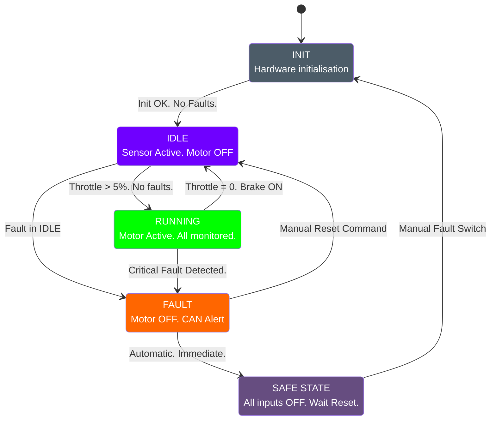

# Requirements Specification - EV ECU System

| |  |
|:---|:---|
| **Organisation** | [basesync](https://github.com/basesync) |
| **Project Version** | v1.0.0 |
| **Last Updated** | 2026 |
| **Owner** | [@Rohith-Kalarikkal](https://github.com/Rohith-Kalarikkal) |
| **Status** | ✅ Approved |

---

## Table of Contents

1. [Introduction](#introduction)
2. [Functional Requirements](#functional-requirements)
   - [FR-001 — Sensor Reading](#fr-001--sensor-reading)
   - [FR-002 — Motor Control](#fr-002--motor-control)
   - [FR-003 — Fault Detection & Safety](#fr-003--fault-detection--safety)
   - [FR-004 — Communication (CAN Bus)](#fr-004--communication-can-bus)
   - [FR-005 — UART / Data Logging](#fr-005--uart--data-logging)
   - [FR-006 — State Machine](#fr-006--state-machine)
3. [Non-Functional Requirements](#non-functional-requirements)
4. [Assumptions](#assumptions)
5. [Requirements Traceability Matrix](#requirements-traceability-matrix)

---

## Introduction

### What Is a Requirements Document?

Before any engineer writes code, the team must agree on what the system needs to do. This document captures:

- **Functional Requirements (FR)** - The specific things the system **MUST** do.
- **Non-Functional Requirements (NFR)** - How well it must do them (speed, safety, reliability).

### Scope

This document covers the firmware for the **EV ECU System** running on an **STM32 microcontroller**, including simulation (SIL), hardware bring-up, and HIL phases.

---

## Functional Requirements

### FR-001 — Sensor Reading

| ID | Requirement | Priority |
|---|---|---|
| FR-001-01 | The system SHALL read battery temperature via ADC every 100ms | **MUST** |
| FR-001-02 | The system SHALL read motor temperature via ADC every 100ms | **MUST** |
| FR-001-03 | The system SHALL read battery current via ADC every 50ms | **MUST** |
| FR-001-04 | The system SHALL read battery voltage via ADC every 50ms | **MUST** |
| FR-001-05 | The system SHALL read motor/wheel speed via encoder input every 10ms | **MUST** |
| FR-001-06 | The system SHALL read throttle position (0–100%) via potentiometer/ADC every 10ms | **MUST** |
| FR-001-07 | The system SHALL read brake switch state (ON/OFF) via GPIO every 10ms | **MUST** |
| FR-001-08 | The system SHALL read fault trigger switch state via GPIO every 10ms | **MUST** |

---

### FR-002 — Motor Control

| ID | Requirement | Priority |
|---|---|---|
| FR-002-01 | The system SHALL generate a PWM signal to control motor speed | **MUST** |
| FR-002-02 | The system SHALL scale PWM duty cycle proportionally to throttle position | **MUST** |
| FR-002-03 | The system SHALL set PWM duty cycle to 0% immediately when brake is active | **MUST** |
| FR-002-04 | The system SHALL set PWM duty cycle to 0% when any critical fault is active | **MUST** |
| FR-002-05 | The system SHALL implement a soft-start ramp (0 to target in 500ms min) | **SHOULD** |
| FR-002-06 | The system SHALL implement regenerative braking signal output (future) | **COULD** |

---

### FR-003 — Fault Detection & Safety

| ID | Requirement | Priority |
|---|---|---|
| FR-003-01 | The system SHALL detect over-temperature (battery >60°C) and set `FAULT_OVER_TEMP` | **MUST** |
| FR-003-02 | The system SHALL detect over-current (>50A simulated) and set `FAULT_OVER_CURRENT` | **MUST** |
| FR-003-03 | The system SHALL detect under-voltage (<3.0V cell simulated) and set `FAULT_UNDER_VOLTAGE` | **MUST** |
| FR-003-04 | The system SHALL detect over-voltage (>4.2V cell simulated) and set `FAULT_OVER_VOLTAGE` | **MUST** |
| FR-003-05 | The system SHALL enter `SAFE_STATE` (motor OFF, CAN fault frame sent) on any critical fault | **MUST** |
| FR-003-06 | The system SHALL activate the manual fault trigger switch to simulate any fault for testing | **MUST** |
| FR-003-07 | The system SHALL implement a watchdog timer. Failure to feed watchdog → system reset | **MUST** |
| FR-003-08 | The system SHALL store fault codes in non-volatile memory (simulated via EEPROM/Flash) | **SHOULD** |
| FR-003-09 | The system SHALL allow fault clearing only via explicit command, not automatically | **MUST** |

---

### FR-004 — Communication (CAN Bus)

| ID | Requirement | Priority |
|---|---|---|
| FR-004-01 | The system SHALL transmit a periodic Status Frame over CAN every 100ms | **MUST** |
| FR-004-02 | The system SHALL transmit a Fault Frame over CAN immediately upon fault detection | **MUST** |
| FR-004-03 | The system SHALL transmit sensor data (temp, voltage, current, speed) over CAN | **MUST** |
| FR-004-04 | The system SHALL receive control commands over CAN (e.g., speed setpoint) | **SHOULD** |
| FR-004-05 | CAN frames SHALL use standard 11-bit identifiers | **MUST** |

#### CAN Message Table

| CAN ID | Name | Period | Content |
|---|---|---|---|
| `0x100` | `EV_STATUS` | 100ms | Vehicle state, fault flags |
| `0x101` | `SENSOR_PACK_1` | 100ms | Batt temp, Motor temp, Speed |
| `0x102` | `SENSOR_PACK_2` | 100ms | Voltage, Current, Throttle % |
| `0x1FF` | `FAULT_FRAME` | On-event | Fault code, fault timestamp |

---

### FR-005 — UART / Data Logging

| ID | Requirement | Priority |
|---|---|---|
| FR-005-01 | The system SHALL output sensor readings over UART at 115200 baud | **MUST** |
| FR-005-02 | Log format SHALL be Teleplot-compatible (`>label:value`) for live plotting | **MUST** |
| FR-005-03 | The system SHALL log fault events with a timestamp | **MUST** |
| FR-005-04 | The system SHALL log system state changes (e.g., `IDLE → RUNNING → FAULT`) | **MUST** |

#### UART Log Format (Teleplot)

```
>batt_temp:35.2
>motor_temp:42.1
>speed:120
>voltage:52.4
>current:18.3
>throttle:65
>fault_code:0
```

---

### FR-006 — State Machine

The ECU shall implement the following state machine:



> **States:** `INIT` → `IDLE` → `RUNNING` ↔ `SAFE_STATE`

---

## Non-Functional Requirements

| ID | Requirement | Metric |
|---|---|---|
| NFR-001 | Fault detection response time | < 10ms from sensor read to `SAFE_STATE` |
| NFR-002 | Sensor sampling jitter | < 5ms deviation from scheduled period |
| NFR-003 | CAN transmission reliability | 0 missed periodic frames in 1hr test |
| NFR-004 | Code coverage (unit tests) | ≥ 80% line coverage |
| NFR-005 | Static analysis | 0 Cppcheck errors, 0 critical warnings |
| NFR-006 | Build time | Full clean build < 60 seconds |
| NFR-007 | Memory (Flash) | Must fit within 64KB Flash |
| NFR-008 | Memory (RAM) | Must use < 20KB RAM |
| NFR-009 | UART baud rate | 115200 baud, 8N1 |
| NFR-010 | Watchdog timeout | 500ms |

---

## Assumptions

| ID | Assumption |
|---|---|
| A-001 | Sensor values are simulated via potentiometers / GPIO switches in hardware stage |
| A-002 | Motor is simulated by an LED or PWM output in SIL stage |
| A-003 | CAN bus is simulated using BusMaster + Virtual CAN driver |
| A-004 | Battery parameters are based on a 48V lithium pack (simulated values) |
| A-005 | Team has access to at least one STM32 board for HIL testing |

---

## Requirements Traceability Matrix

> This links each requirement to its test case. Fill this in as tests are written.

| Req ID | Description | Test Case ID | Status |
|---|---|---|---|
| FR-001-01 | Read battery temperature | TC-SENSOR-001 | 🟡 Planned |
| FR-001-06 | Read throttle position | TC-SENSOR-006 | 🟡 Planned |
| FR-002-03 | Brake cuts PWM | TC-MOTOR-003 | 🟡 Planned |
| FR-003-01 | Over-temp fault | TC-FAULT-001 | 🟡 Planned |
| FR-003-07 | Watchdog reset | TC-FAULT-007 | 🟡 Planned |
| FR-004-01 | CAN status frame | TC-CAN-001 | 🟡 Planned |
| FR-005-01 | UART output | TC-UART-001 | 🟡 Planned |

### Status Legend

| Symbol | Meaning |
|---|---|
| 🟡 | **Planned** — test not yet written |
| 🔵 | **Written** — test written, not yet run |
| 🟢 | **Passing** — test written and passing |
| 🔴 | **Failing** — test written but failing |

---

*basesync · Requirements · 03*
