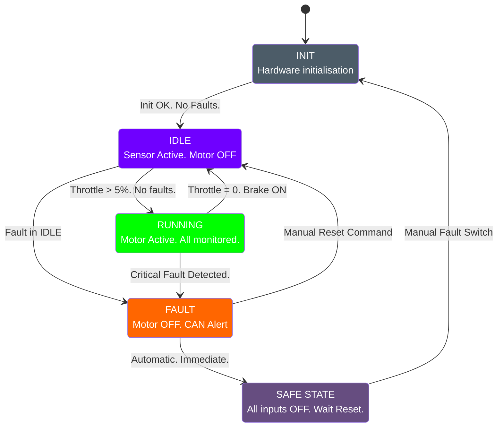

# Requirements Specification — Smart EV ECU

| Field           | Value            |
| --------------- | ---------------- |
| **Document ID** | BASESYNC-REQ-001 |
| **Version**     | 1.0              |
| **Status**      | ✅ Approved       |
| **Owner**       | Full Team        |

***

## Table of Contents

1. [Introduction](./#introduction)
2. [Functional Requirements](./#functional-requirements)
   * [FR-001 — Sensor Reading](./#fr-001--sensor-reading)
   * [FR-002 — Motor Control](./#fr-002--motor-control)
   * [FR-003 — Fault Detection & Safety](./#fr-003--fault-detection--safety)
   * [FR-004 — Communication (CAN Bus)](./#fr-004--communication-can-bus)
   * [FR-005 — UART / Data Logging](./#fr-005--uart--data-logging)
   * [FR-006 — State Machine](./#fr-006--state-machine)
3. [Non-Functional Requirements](./#non-functional-requirements)
4. [Assumptions](./#assumptions)
5. [Requirements Traceability Matrix](./#requirements-traceability-matrix)

***

## Introduction

### What Is a Requirements Document?

Before any engineer writes code, the team must agree on what the system needs to do. This document captures:

* **Functional Requirements (FR)** — The specific things the system **MUST** do.
* **Non-Functional Requirements (NFR)** — How well it must do them (speed, safety, reliability).

### Scope

This document covers the firmware for the **Smart EV ECU** running on an **STM32 microcontroller**, including simulation (SIL), hardware bring-up, and HIL phases.

***

## Functional Requirements

### FR-001 — Sensor Reading

<table><thead><tr><th width="109.79998779296875">ID</th><th width="567">Requirement</th><th>Priority</th></tr></thead><tbody><tr><td>FR-001-01</td><td>The system SHALL read battery temperature via ADC every 100ms</td><td><strong>MUST</strong></td></tr><tr><td>FR-001-02</td><td>The system SHALL read motor temperature via ADC every 100ms</td><td><strong>MUST</strong></td></tr><tr><td>FR-001-03</td><td>The system SHALL read battery current via ADC every 50ms</td><td><strong>MUST</strong></td></tr><tr><td>FR-001-04</td><td>The system SHALL read battery voltage via ADC every 50ms</td><td><strong>MUST</strong></td></tr><tr><td>FR-001-05</td><td>The system SHALL read motor/wheel speed via encoder input every 10ms</td><td><strong>MUST</strong></td></tr><tr><td>FR-001-06</td><td>The system SHALL read throttle position (0–100%) via potentiometer/ADC every 10ms</td><td><strong>MUST</strong></td></tr><tr><td>FR-001-07</td><td>The system SHALL read brake switch state (ON/OFF) via GPIO every 10ms</td><td><strong>MUST</strong></td></tr><tr><td>FR-001-08</td><td>The system SHALL read fault trigger switch state via GPIO every 10ms</td><td><strong>MUST</strong></td></tr></tbody></table>

***

### FR-002 — Motor Control

<table><thead><tr><th width="109.7999267578125">ID</th><th width="553.5999755859375">Requirement</th><th>Priority</th></tr></thead><tbody><tr><td>FR-002-01</td><td>The system SHALL generate a PWM signal to control motor speed</td><td><strong>MUST</strong></td></tr><tr><td>FR-002-02</td><td>The system SHALL scale PWM duty cycle proportionally to throttle position</td><td><strong>MUST</strong></td></tr><tr><td>FR-002-03</td><td>The system SHALL set PWM duty cycle to 0% immediately when brake is active</td><td><strong>MUST</strong></td></tr><tr><td>FR-002-04</td><td>The system SHALL set PWM duty cycle to 0% when any critical fault is active</td><td><strong>MUST</strong></td></tr><tr><td>FR-002-05</td><td>The system SHALL implement a soft-start ramp (0 to target in 500ms min)</td><td><strong>SHOULD</strong></td></tr><tr><td>FR-002-06</td><td>The system SHALL implement regenerative braking signal output (future)</td><td><strong>COULD</strong></td></tr></tbody></table>

***

### FR-003 — Fault Detection & Safety

<table><thead><tr><th width="113.79998779296875">ID</th><th width="548.9998779296875">Requirement</th><th>Priority</th></tr></thead><tbody><tr><td>FR-003-01</td><td>The system SHALL detect over-temperature (battery >60°C) and set <code>FAULT_OVER_TEMP</code></td><td><strong>MUST</strong></td></tr><tr><td>FR-003-02</td><td>The system SHALL detect over-current (>50A simulated) and set <code>FAULT_OVER_CURRENT</code></td><td><strong>MUST</strong></td></tr><tr><td>FR-003-03</td><td>The system SHALL detect under-voltage (&#x3C;3.0V cell simulated) and set <code>FAULT_UNDER_VOLTAGE</code></td><td><strong>MUST</strong></td></tr><tr><td>FR-003-04</td><td>The system SHALL detect over-voltage (>4.2V cell simulated) and set <code>FAULT_OVER_VOLTAGE</code></td><td><strong>MUST</strong></td></tr><tr><td>FR-003-05</td><td>The system SHALL enter <code>SAFE_STATE</code> (motor OFF, CAN fault frame sent) on any critical fault</td><td><strong>MUST</strong></td></tr><tr><td>FR-003-06</td><td>The system SHALL activate the manual fault trigger switch to simulate any fault for testing</td><td><strong>MUST</strong></td></tr><tr><td>FR-003-07</td><td>The system SHALL implement a watchdog timer. Failure to feed watchdog → system reset</td><td><strong>MUST</strong></td></tr><tr><td>FR-003-08</td><td>The system SHALL store fault codes in non-volatile memory (simulated via EEPROM/Flash)</td><td><strong>SHOULD</strong></td></tr><tr><td>FR-003-09</td><td>The system SHALL allow fault clearing only via explicit command, not automatically</td><td><strong>MUST</strong></td></tr></tbody></table>

***

### FR-004 — Communication (CAN Bus)

<table><thead><tr><th width="113.79998779296875">ID</th><th width="549">Requirement</th><th>Priority</th></tr></thead><tbody><tr><td>FR-004-01</td><td>The system SHALL transmit a periodic Status Frame over CAN every 100ms</td><td><strong>MUST</strong></td></tr><tr><td>FR-004-02</td><td>The system SHALL transmit a Fault Frame over CAN immediately upon fault detection</td><td><strong>MUST</strong></td></tr><tr><td>FR-004-03</td><td>The system SHALL transmit sensor data (temp, voltage, current, speed) over CAN</td><td><strong>MUST</strong></td></tr><tr><td>FR-004-04</td><td>The system SHALL receive control commands over CAN (e.g., speed setpoint)</td><td><strong>SHOULD</strong></td></tr><tr><td>FR-004-05</td><td>CAN frames SHALL use standard 11-bit identifiers</td><td><strong>MUST</strong></td></tr></tbody></table>

#### CAN Message Table

<table><thead><tr><th width="111">CAN ID</th><th width="174.5999755859375">Name</th><th width="114.4000244140625">Period</th><th>Content</th></tr></thead><tbody><tr><td><code>0x100</code></td><td><code>EV_STATUS</code></td><td>100ms</td><td>Vehicle state, fault flags</td></tr><tr><td><code>0x101</code></td><td><code>SENSOR_PACK_1</code></td><td>100ms</td><td>Batt temp, Motor temp, Speed</td></tr><tr><td><code>0x102</code></td><td><code>SENSOR_PACK_2</code></td><td>100ms</td><td>Voltage, Current, Throttle %</td></tr><tr><td><code>0x1FF</code></td><td><code>FAULT_FRAME</code></td><td>On-event</td><td>Fault code, fault timestamp</td></tr></tbody></table>

***

### FR-005 — UART / Data Logging

<table><thead><tr><th width="115.39996337890625">ID</th><th width="560">Requirement</th><th>Priority</th></tr></thead><tbody><tr><td>FR-005-01</td><td>The system SHALL output sensor readings over UART at 115200 baud</td><td><strong>MUST</strong></td></tr><tr><td>FR-005-02</td><td>Log format SHALL be Teleplot-compatible (<code>>label:value</code>) for live plotting</td><td><strong>MUST</strong></td></tr><tr><td>FR-005-03</td><td>The system SHALL log fault events with a timestamp</td><td><strong>MUST</strong></td></tr><tr><td>FR-005-04</td><td>The system SHALL log system state changes (e.g., <code>IDLE → RUNNING → FAULT</code>)</td><td><strong>MUST</strong></td></tr></tbody></table>

#### UART Log Format (Teleplot)

```
>batt_temp:35.2
>motor_temp:42.1
>speed:120
>voltage:52.4
>current:18.3
>throttle:65
>fault_code:0
```

***

### FR-006 — State Machine

The ECU shall implement the following state machine:



> **States:** `INIT` → `IDLE` → `RUNNING` ↔ `SAFE_STATE`

***

## Non-Functional Requirements

<table><thead><tr><th width="98.5999755859375">ID</th><th width="303.2000732421875">Requirement</th><th>Metric</th></tr></thead><tbody><tr><td>NFR-001</td><td>Fault detection response time</td><td>&#x3C; 10ms from sensor read to <code>SAFE_STATE</code></td></tr><tr><td>NFR-002</td><td>Sensor sampling jitter</td><td>&#x3C; 5ms deviation from scheduled period</td></tr><tr><td>NFR-003</td><td>CAN transmission reliability</td><td>0 missed periodic frames in 1hr test</td></tr><tr><td>NFR-004</td><td>Code coverage (unit tests)</td><td>≥ 80% line coverage</td></tr><tr><td>NFR-005</td><td>Static analysis</td><td>0 Cppcheck errors, 0 critical warnings</td></tr><tr><td>NFR-006</td><td>Build time</td><td>Full clean build &#x3C; 60 seconds</td></tr><tr><td>NFR-007</td><td>Memory (Flash)</td><td>Must fit within 64KB Flash</td></tr><tr><td>NFR-008</td><td>Memory (RAM)</td><td>Must use &#x3C; 20KB RAM</td></tr><tr><td>NFR-009</td><td>UART baud rate</td><td>115200 baud, 8N1</td></tr><tr><td>NFR-010</td><td>Watchdog timeout</td><td>500ms</td></tr></tbody></table>

***

## Assumptions

<table><thead><tr><th width="79.60003662109375">ID</th><th>Assumption</th></tr></thead><tbody><tr><td>A-001</td><td>Sensor values are simulated via potentiometers / GPIO switches in hardware stage</td></tr><tr><td>A-002</td><td>Motor is simulated by an LED or PWM output in SIL stage</td></tr><tr><td>A-003</td><td>CAN bus is simulated using BusMaster + Virtual CAN driver</td></tr><tr><td>A-004</td><td>Battery parameters are based on a 48V lithium pack (simulated values)</td></tr><tr><td>A-005</td><td>Team has access to at least one STM32 board for HIL testing</td></tr></tbody></table>

***

## Requirements Traceability Matrix

> This links each requirement to its test case. Fill this in as tests are written.

<table><thead><tr><th width="115.79998779296875">Req ID</th><th width="241">Description</th><th width="251.60009765625">Test Case ID</th><th>Status</th></tr></thead><tbody><tr><td>FR-001-01</td><td>Read battery temperature</td><td>TC-SENSOR-001</td><td>🟡 Planned</td></tr><tr><td>FR-001-06</td><td>Read throttle position</td><td>TC-SENSOR-006</td><td>🟡 Planned</td></tr><tr><td>FR-002-03</td><td>Brake cuts PWM</td><td>TC-MOTOR-003</td><td>🟡 Planned</td></tr><tr><td>FR-003-01</td><td>Over-temp fault</td><td>TC-FAULT-001</td><td>🟡 Planned</td></tr><tr><td>FR-003-07</td><td>Watchdog reset</td><td>TC-FAULT-007</td><td>🟡 Planned</td></tr><tr><td>FR-004-01</td><td>CAN status frame</td><td>TC-CAN-001</td><td>🟡 Planned</td></tr><tr><td>FR-005-01</td><td>UART output</td><td>TC-UART-001</td><td>🟡 Planned</td></tr></tbody></table>

### Status Legend

<table><thead><tr><th width="98.7999267578125">Symbol</th><th>Meaning</th></tr></thead><tbody><tr><td>🟡</td><td><strong>Planned</strong> — test not yet written</td></tr><tr><td>🔵</td><td><strong>Written</strong> — test written, not yet run</td></tr><tr><td>🟢</td><td><strong>Passing</strong> — test written and passing</td></tr><tr><td>🔴</td><td><strong>Failing</strong> — test written but failing</td></tr></tbody></table>

***

_BASESYNC-REQ-001 · v1.0 · Approved_
