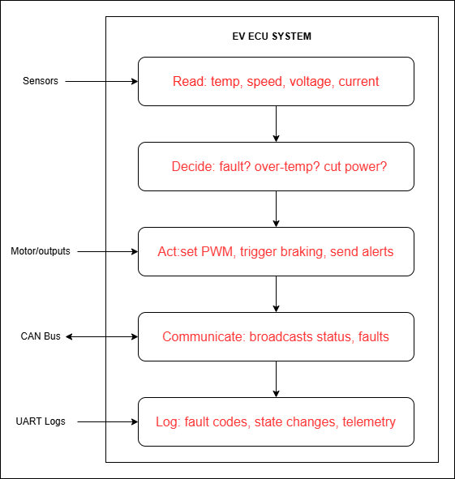
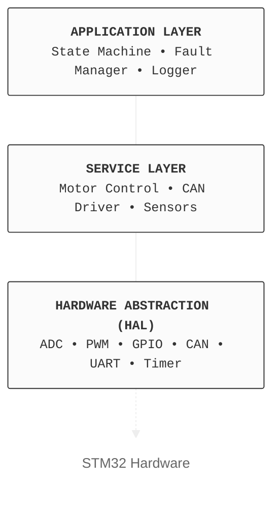

# EV Control & Diagnostics System — Project Overview

| |  |
|:---|:---|
| **Organisation** | [basesync](https://github.com/basesync) |
| **Project Version** | v1.0.0 |
| **Last Updated** | 2026 |
| **Owner** | [@Rohith-Kalarikkal](https://github.com/Rohith-Kalarikkal) |
| **Status** | ✅ Approved  |

---

## Table of Contents

1. [What Is This Project?](#what-is-this-project)
2. [Why Are We Building This?](#why-are-we-building-this)
3. [What Does an ECU Actually Do?](#what-does-an-ecu-actually-do)
4. [Project Goals](#project-goals)
5. [System Architecture](#system-architecture)
6. [Stages of the Project](#stages-of-the-project)
7. [Team Structure](#team-structure)
8. [Technology Stack](#technology-stack)
9. [Before Writing the Code](#before-writing-the-code)
10. [GitHub Organisation Structure](#github-organisation-structure)

---

## What Is This Project?

We are building a **EV (Electric Vehicle) Control & Diagnostics System** + a software + firmware system that mimics what a real EV's **ECU (Electronic Control Unit)** does.

It:

- Reads sensors (temperature, speed, voltage, current)
- Makes decisions (is the battery overheating? should I cut power?)
- Controls outputs (motor speed, braking, alerts)
- Communicates with other modules over a bus (CAN bus)
- Logs faults and helps engineers diagnose problems

We are building this on an **STM32 microcontroller**, starting from pure simulation, then moving to real hardware.

---

## Why Are We Building This?

This project is designed to demonstrate a broad set of industry-relevant engineering skills:

| Skill Area | What It Is |
|---|---|
| **Embedded C Programming** | Writing low-level firmware for real hardware |
| **Agile + DevOps** | How real MNC teams manage and ship software |
| **CAN Bus Communication** | Industry-standard vehicle networking protocol |
| **CI/CD Pipelines** | Automated testing and deployment |
| **Safety-Critical Design** | Fault detection, watchdogs, safe states |
| **Simulation-First Development** | SIL → HIL workflow used in the automotive industry |
| **RTOS** | Managing multiple tasks simultaneously with FreeRTOS |

---

## What Does an ECU Actually Do?



---

## Project Goals

### Primary Goals

- Implement full sensor reading pipeline on STM32
- Implement motor control loop (PWM-based)
- Implement CAN Bus communication (simulated via BusMaster)
- Implement fault detection and safe state management
- Implement data logging over UART
- Visualise live data using Teleplot / STM32CubeMonitor
- Achieve >80% unit test coverage using Unity framework
- Pass all CI/CD pipeline checks on every commit

### Stretch Goals

- Port bare-metal code to FreeRTOS tasks
- Implement a basic bootloader
- Build a desktop GUI dashboard
- Perform full HIL testing on physical STM32 hardware

---

## System Architecture



---

## Stages of the Project

### Stage 1 - Code & Simulation (SIL)

All code runs entirely in simulation. No physical hardware needed.

```
[Write C Code] → [Simulate on Wokwi/Renode] → [Test with Unity] → [CI/CD checks pass]
```

### Stage 2 - Hardware Bring-Up

Flash the same code onto a real STM32 board. Fix any hardware-specific bugs.

```
[Stage 1 Code] → [Flash to STM32] → [Oscilloscope / Logic Analyser checks] → [Fix HW bugs]
```

### Stage 3 - HIL Testing

Real hardware, but sensors and motor are simulated by external equipment.

```
[STM32 Hardware] ↔ [HIL Simulator / BusMaster CAN] → [Automated Test Suite]
```

### Stage 4 - RTOS + Bootloader *(Advanced)*

Port the system to FreeRTOS, add a bootloader, and build a GUI.

```
[Bare-Metal Firmware] → [FreeRTOS Tasks] → [Bootloader] → [Desktop GUI Dashboard]
```

---

## Team Structure

> All 4 members contribute to everything. Roles define primary ownership, not exclusivity.

| Member | GitHub Handle |
|---|---|
| Rohith Kalarikkal Ramakrishnan | [@Rohith-Kalarikkal](https://github.com/Rohith-Kalarikkal) |
| Roshan M Ganesh | [@RoshanMGanesh](https://github.com/RoshanMGanesh) |
| Rajeev Manohar | [@rajeev-manohar](https://github.com/rajeev-manohar) |
| Ashmi Shaju | [@AshmiShaju619](https://github.com/AshmiShaju619) |

---

## Technology Stack

| Category | Tool | Why |
|---|---|---|
| **MCU Target** | STM32 (e.g., STM32F103/F4) | Industry-standard, huge community, HAL available |
| **IDE** | VS Code + STM32CubeIDE | Free, powerful, industry used |
| **Language** | Embedded C (C99) | Standard for embedded systems |
| **Build System** | CMake + `arm-none-eabi-gcc` | MNC-standard toolchain |
| **RTOS** | FreeRTOS | Most popular RTOS in embedded |
| **Simulation** | Wokwi / Renode | Free, browser-based SIL simulation |
| **CAN Simulation** | BusMaster | Open-source CAN bus simulator |
| **Unit Testing** | Unity Framework | C unit testing, MISRA-friendly |
| **Static Analysis** | Cppcheck | Free, VS Code integrated |
| **CI/CD** | GitHub Actions | Free for public repos |
| **Security** | Snyk + Dependabot | Free tier, automated scanning |
| **Visualisation** | Teleplot (VS Code) | Real-time serial plotter |
| **Documentation** | Gitbook | Industry-standard wiki |
| **Project Mgmt** | GitHub Projects | Kanban + sprint planning |
| **Version Control** | Git + GitHub | Industry standard |

---

## Before Writing the Code

Follow these steps in order. **Do not skip ahead to Step 8.**

### Step 1 - Requirements Gathering

Define what the system must do and how well it must do it.

- **Functional Requirements** - *What* it does (e.g., "The system shall read battery temperature every 100ms")
- **Non-Functional Requirements** - *How well* it does it (e.g., "Fault detection shall trigger within 10ms of threshold breach")

→ See: `03_requirements`

### Step 2 - System Design

Draw the architecture. Define all modules. Decide interfaces between modules. No code — just boxes and arrows.

→ See: `04_system_design`

### Step 3 - Set Up Your Environment

Install all tools. Make sure every team member has the same setup. Write it down so a new joiner can replicate it in 30 minutes.

→ See: `01_environment_setup`

### Step 4 — Set Up GitHub

Create branch protection rules, PR templates, and issue templates.

→ See: `02_gitHub_setup`

### Step 5 — Set Up CI/CD Pipeline

GitHub Actions must run on every Pull Request. Nothing merges without passing.

→ See: `05_cicd_pipelines`

### Step 6 — Define Coding Standards

Agree on naming conventions, file structure, and comment style **before anyone writes code**.

→ See: `06_coding_standards`

### Step 7 — Sprint Planning

Break requirements into User Stories. Estimate effort. Assign to Sprint 1.

→ See: Sprint Planning board

### Step 8 — Start Coding

**Now, and only now, do you write code.**

---

## GitHub Organisation Structure

**Organisation:** [basesync](https://github.com/basesync)

### Repositories

| Repo Name | Purpose |
|---|---|
| [`basesync/ev-ecu-system`](https://github.com/basesync/ev-ecu-system) | Main firmware repository |
| `basesync/ev-ecu-tests` | Upcoming |

### Branch Protection Rules (`main` → `develop`)

- Require Pull Request before merging
- Require at least 1 approving review
- Require all CI checks to pass
- No force pushes allowed

---

*basesync · EV ECU System · v1.0.0 · 2026*
